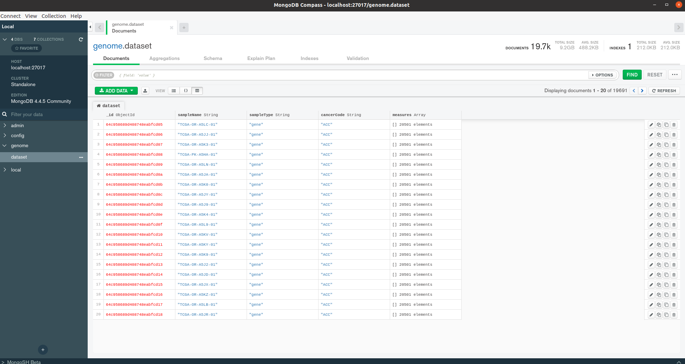

# Description
Genome Importer Mongo JS

# Infrastructure
Execute this command to create the infrastructure about database:

```
docker run -d -p 27017:27017 --name=genome-mongo-db -e MONGO_INITDB_ROOT_USERNAME=root -e MONGO_INITDB_ROOT_PASSWORD=password -e MONGO_INITDB_DATABASE=genome mongo:latest
```

# Dataset
We must download The Cancer Genome Atlas (TCGA) Dataset locally in the default folder called downloaded_data, previous to import in mongoDB

# Execution
Execute this command to import the dataset in mongoDB:

```
npm install

node --max_old_space_size=8048 app.js
```

genome-db database:

